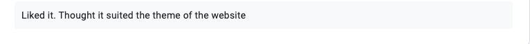

#### [Click Here for Firebase Hosted Site](https://experiencecanada.web.app/)

 <br /> 

# Introduction
##### As part of the assessment for Web Site Design SWD500 the task was to create a responsive website on a theme my choice. The chosen theme was life in Canada. The intended outcome for this project is to provide further attention to the country as a holiday destination or a place people might wish to immigrate to. The website will highlight such topics as culture, sports, wildlife, and landmarks. The objective is to educate users about the country, encourage them to visit and experience what it has to offer. Above all else the site should respond to different screen sizes e.g. mobiles and desktops. The project will consist of six pages and use HTML, CSS, and JavaScript.

 <br /> 

# CodingStyleGuide Overview 
##### The [attached](https://github.com/whdesigns/ExperienceCanadaProject/blob/master/codingStyleGuide.md) markdown file discusses suggested functions included in the website, as well as the right and wrong approaches for best coding practice. 
##### Note: This file was written during the planning stage and since then many fucntions and features have changed or been removed. 

 <br /> 

# Part One - Configuration

#### Step One: 
###### Open Command line on either Windows or Mac and type in the following to clone the repo onto your desktop:

```
cd ~/Desktop/

git clone https://github.com/whdesigns/ExperienceCanadaProject
```

 <br /> 
 
#### Step Two:
###### Open the cloned repo inside Visual Studio Code on either Windows or Mac.

###### Note: Ensure Node JS is installed. If not [click here](https://nodejs.org/en/) to download it. Once installed npm will be available to use on the terminal. Type....
 
 ```
node -v
 ```
###### in the terminal to ensure the latest version has been installed. 

  <br /> 

#### Step Three:
###### Right click on the "public" folder and select "Open in Terminal". 
###### Type the following into the terminal to install gulp

 ```
sudo npm install gulp-cli -g
 ```
###### After typing in the above code npm will ask for a "password", which is used for your computer.
 
###### Type...

 ```
gulp -v
 ```
###### to check if the latest version of gulp has been installed.

  <br />

#### Step Four: 
###### Install gulp-sass and browser-sync by typing the following into the terminial 

 ```
npm install --save-dev gulp gulp-sass browser-sync
 ```
###### This will automatically update the dependencies in the package.JSON file.
 
   <br />

#### Step Five:
###### Type following into the terminal to pull up the website using your localhost with the use of browser-sync


 ```
gulp watch
 ```

  <br /> 
  
# Part Two - Test Plan Results  

## Technical Test Plan
##### Created in MS Word. A technical test plan was essential to ensure the website is error-free and ready for deployment. Screenshots of the tests conducted can be seen below. 


## User Testing
##### Google Forms was used to ask 10 people to critique this website. Below are the results of the feedback they provided.




# Part Three - Screenshot Evidence

#### Home (Desktop)


 
  <br /> 

#### Culture (Desktop)


 <br /> 

#### Wildlife (Desktop)


 <br /> 

#### Landmarks (Desktop)


 <br /> 

#### Sports (Desktop)


 <br /> 

#### Contact Us (Desktop)


 <br /> 

#### Home (Mobile)


 <br /> 

#### Culture (Mobile)


#### Wildlife (Mobile)


 <br /> 

#### Landmarks (Mobile)


 <br /> 

#### Sports (Mobile)


 <br /> 

#### Contact Us (Mobile)


# Part Four - Reflective Evaluation
